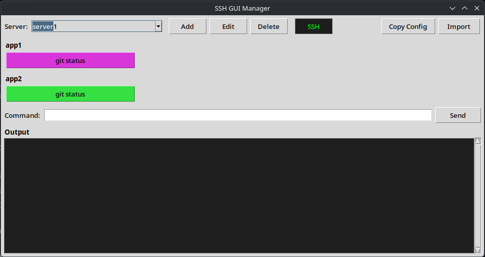
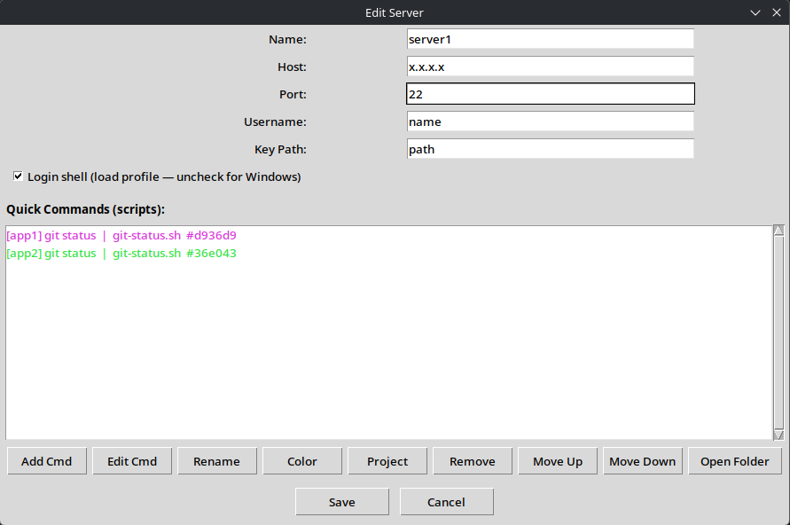

# SSH Deck

A lightweight desktop SSH management tool built with Python, Tkinter, and Paramiko. Manage multiple remote servers, run commands, and execute scripts — all from a single GUI.



## Features

- **Server Management** — Add, edit, and delete SSH server configurations
- **Quick Command Buttons** — Per-server script buttons with custom labels and colors, grouped by project
- **Shared Scripts** — Write a script once in a `_shared` folder and reuse it across projects and servers
- **SFTP Downloads** — A script can copy a remote file or folder to this machine instead of running a command
- **Live Streaming Output** — Real-time output with color-coded tags (blue = command, green = output, red = error)
- **Per-Server Output** — Each server keeps its own output panel; long output (>20 lines) pops out into a separate window with a Save Log button
- **Command Input** — Type and send ad-hoc commands to the selected server
- **SSH Terminal** — Open an interactive `ssh` session to the selected server in a terminal (`$TERMINAL`, or the first common terminal emulator found)
- **Config Export / Import** — Copy every server, command, and script to the clipboard as JSON and import it on another machine

## Requirements

- Python 3
- [Paramiko](https://www.paramiko.org/)
- Tkinter — included with most Python installations. On Debian/Ubuntu: `sudo apt install python3-tk`

## Usage

```
python3 -m venv venv
./start.sh
```

`start.sh` activates the venv, installs `requirements.txt` if Paramiko is missing, and launches `ssh_deck.py`.

## Project Structure

```
├── ssh_deck.py           # Main application
├── start.sh              # Launch script
├── requirements.txt      # Python dependencies
├── icon.png              # App icon (bundled into the AppImage)
├── appimage-build.sh     # Build a standalone AppImage
└── scripts/              # Server config and scripts (not committed)
    ├── _shared/          # Scripts shared by every server
    └── <server>/
        ├── server.json   # Connection settings
        ├── _shared/      # Scripts shared by this server's projects
        ├── ALL/          # Commands without a project
        │   ├── commands.json
        │   └── clean-disk.sh
        └── <project>/
            ├── commands.json
            └── git-pull.sh
```

When run from source, `scripts/` lives next to `ssh_deck.py`. The packaged AppImage keeps it in `~/.config/ssh-deck/scripts/` instead (an existing `~/.config/ssh-gui-manager/` from before the rename is moved there on first launch).

## Server Configuration

Servers are managed through the GUI (Add/Edit/Delete buttons). Each server stores:

| Field | Description |
|-------|-------------|
| Name | Display name and scripts folder name |
| Host | Hostname or IP address |
| Port | SSH port (default: 22) |
| Username | SSH login user |
| Key Path | Path to SSH private key |
| Login Shell | Wrap commands in `bash -l` to load the user profile (uncheck for Windows servers) |



## Quick Commands

Each server can have custom command buttons configured through the Edit dialog:

- **Label** — Button text; also used to name the script file (`Git Pull` → `git-pull.sh`)
- **Script** — Shell script stored in `scripts/<server>/<project>/`
- **Color** — Button color for visual grouping
- **Project** — Groups buttons under a heading and picks the script folder (`ALL` when empty)

The Edit dialog can also rename, reorder (Move Up/Down), and remove commands, and **Open Folder** opens the server's scripts folder.

Each quick command opens its own output window.

### Shared scripts

If a command's script isn't in its project folder, it is looked up in `scripts/<server>/_shared/` and then `scripts/_shared/`. Shared scripts get `PROJECT=<project name in lowercase>` prepended, so one script can serve every project:

```sh
cd ~/Projects/$PROJECT && git pull
```

### Download commands

A script whose first line is `#@download` copies a remote file or folder to this machine over SFTP instead of running a command:

```
#@download
remote: C:\Users\me\Builds\Android
local: ~/Downloads/android-build
```

Folders are copied recursively; existing local files are overwritten. `$PROJECT` works here too when the script comes from a `_shared` folder.

## Config Export / Import

**Copy Config** puts every server, its commands, and all script files on the clipboard as JSON. **Import** accepts that JSON (pasted, or loaded from a file) and overwrites servers and scripts with matching names.

The export includes hostnames, usernames, and key paths (not the keys themselves) — treat it accordingly.

## Building an AppImage

```
APPIMAGETOOL=/path/to/appimagetool-x86_64.AppImage ./appimage-build.sh
```

Run it after creating `venv/` (see [Usage](#usage)); it installs PyInstaller into the venv and bundles `icon.png`. `APPIMAGETOOL` defaults to `appimagetool` on your `PATH`.
